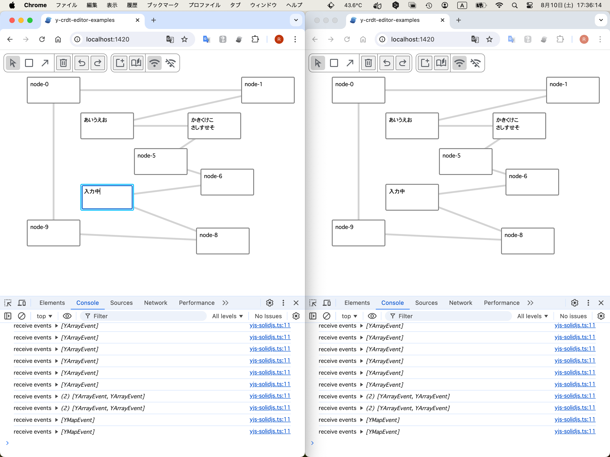

# y-crdt-editor-examples



## setup

```
cd solid-client
npm install
```

## development

1. start websocket server

```
npm run dev-websocket
```

2. start vite

```
npm run dev
```

3. open web browser(s)

```
open http://localhost:1420
```
