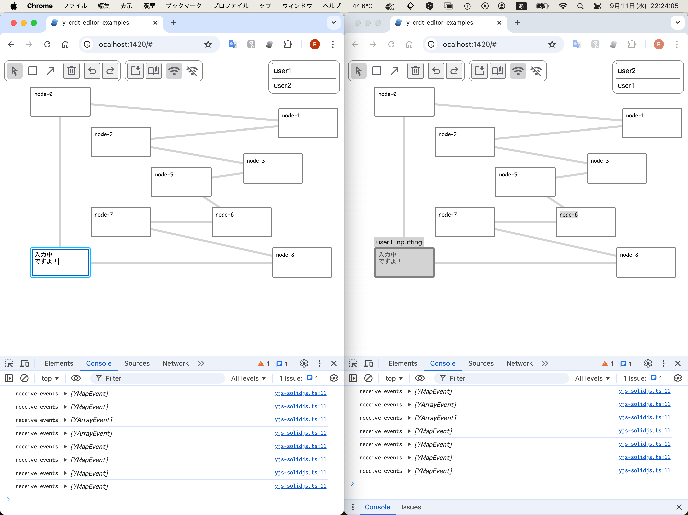

# y-crdt-editor-examples



## setup

```
% cd solid-client
% npm install
```

## development

1. start client  
   (use network)

```
% npm run dev -- --host

> solid-client@0.0.0 dev
> vite --host

  VITE v5.4.0  ready in 159 ms

  ➜  Local:   http://localhost:1420/
  ➜  Network: http://192.168.0.17:1420/
  ➜  press h + enter to show help
```

2. start server  
   (set your network ip address to HOST)

```
% HOST=192.168.0.17 npm run dev-websocket

> solid-client@0.0.0 dev-websocket
> y-websocket --port 1234

running at '192.168.0.17' on port 1234
```

3. open web browser(s)  
   (from your network PC and iPad)

```
% open http://192.168.0.17:1420
```
